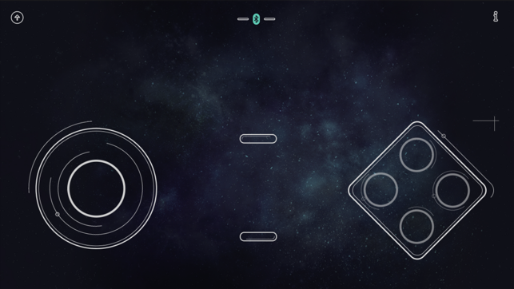
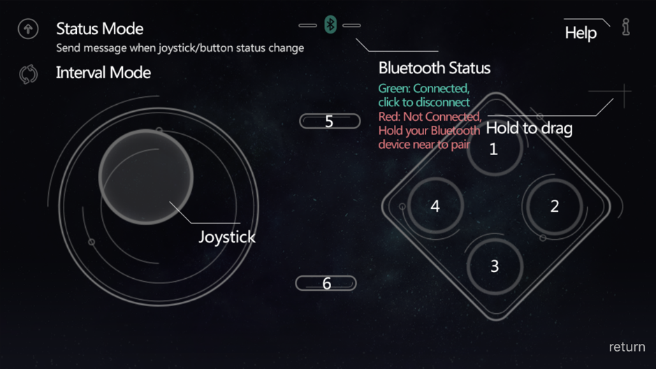

# Analog robot control with BLE

This program creates a reciever for the GoBLE remote app from [DFRobot](https://en.wikipedia.org/wiki/Zhiwei_Robotics_Corp) in the iOS AppStore. With the documentation provided and some reverse engineering the original reciever from DFRobot could be replicated and used for our AISVN robot project.

[GoBLE in the iOS App store](https://apps.apple.com/us/app/goble-bluetooth-4-0-controller/id950937437)

With the code for the ESP32 you have access to an analog joystick and 6 additional buttons that can be used for any purpose. The interface looks like this:

  

## History

`2019/04/08`

Remote control with iOS and BLE finally works! BLE server is configured, the services declared, server can be started and advertised - and can be connected to!

