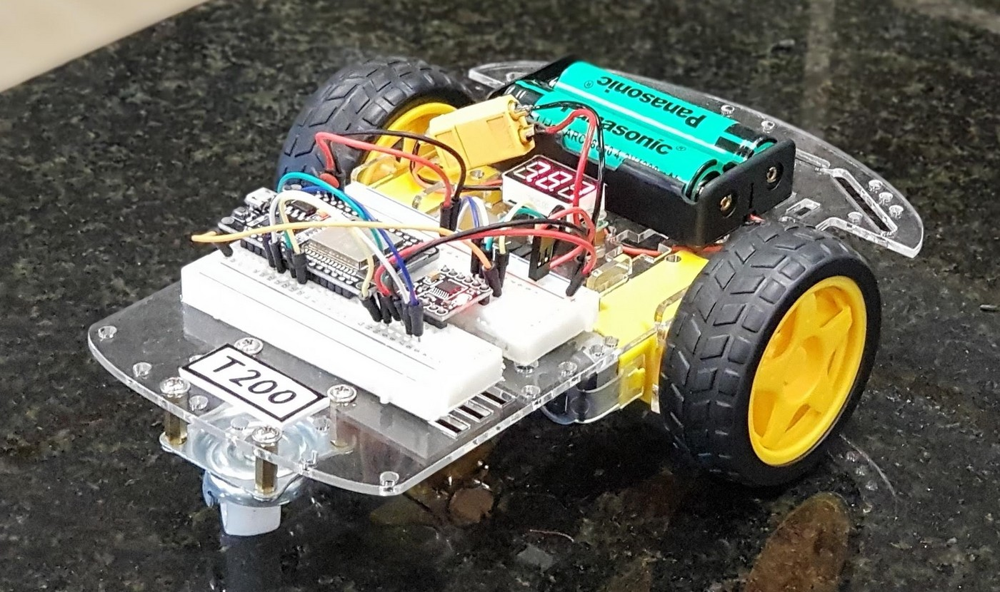

# T200 - ESP32 based robots

This robot car uses the ESP32 to control its actions. The hardware setup is similar, but the upgrades come in software. This is an upgrade from the Arduino Uno powered [T100](https://github.com/kreier/T100). Now WiFi and Bluetooth are build in. And way more storage for our programs.

## Hardware and materials

All materials were ordered at [CỬA HÀNG IC ĐÂY RỒI](https://icdayroi.com/). This is the list:

1. [Khung Xe Robot](https://icdayroi.com/khung-xe-robot) 68.000₫
2. [Kít RF thu phát Wifi BLE ESP32](https://icdayroi.com/kit-rf-thu-phat-wifi-ble-esp32-nodemcu-luanode32) 180.000₫
3. [Mạch điều khiển động cơ DC DRV8833](https://icdayroi.com/mach-dieu-khien-dong-co-dc-drv8833) 20.000₫ motor driver
4. [Đế test board, bread board 85x55mm](https://icdayroi.com/de-test-board-bread-board-85x55mm) 15.000₫
5. [jumper wires](https://icdayroi.com/bo-day-cam-test-board-65-soi) 19.000₫
6. [Đồng hồ đo Vôn (Volt) 3.5-30V](https://icdayroi.com/dong-ho-do-von-volt-3-5-30v) 22.000 ₫

This requires 324.000₫ or $14 USD. For higher speed and the use of PWM capabilities it is recommended to upgrade the powersource:

7. [Pin Cell 18650 4200mAh 3.7V](https://icdayroi.com/pin-cell-18650-4200mah-3-7v) 2x 35.000 ₫
8. [Hộp đế pin 18650 loại 2 cell](https://icdayroi.com/hop-de-pin-18650-loai-2-cell) 7.000 ₫

The initial setup is wired the following:

Here is the image from Fritzing missing ...

## Building steps

* Assemble the robot
* Connect the motors to M1 and M4 on the L293D shield
* Add the AFMotor.h motor library (library/AFMotor.zip) in the Arduino IDE
* Upload the program [T100.ino](T100.ino) to your Arduino Uno
* Install the software [Arduino Bluetooth Controller](https://play.google.com/store/apps/details?id=com.satech.arduinocontroller) to your Android phone
* Connect to the bluetooth module of the robot
* Configure the keys of the remote the following:

## Software

### T200 basic

Here the robot just blinks with the LED, attached to pin 2, and drives the motors forward and backward. The motor controller is connected to pins 16, 17, 18 and 19.

### T200 BT

The robot can be controlled, using Bluetooth 2.0 with the software ... steps follow, straigt forward.

### T200 BLE basic

Using the software ... the arrow keys forward and backward.

### T200 BLE PWM

Now we make use of the analog controller stick and its 255 values to drive the motors with PWM.

Details, instructions and pictures can be found in the [Wiki](https://github.com/kreier/T200/wiki). 
